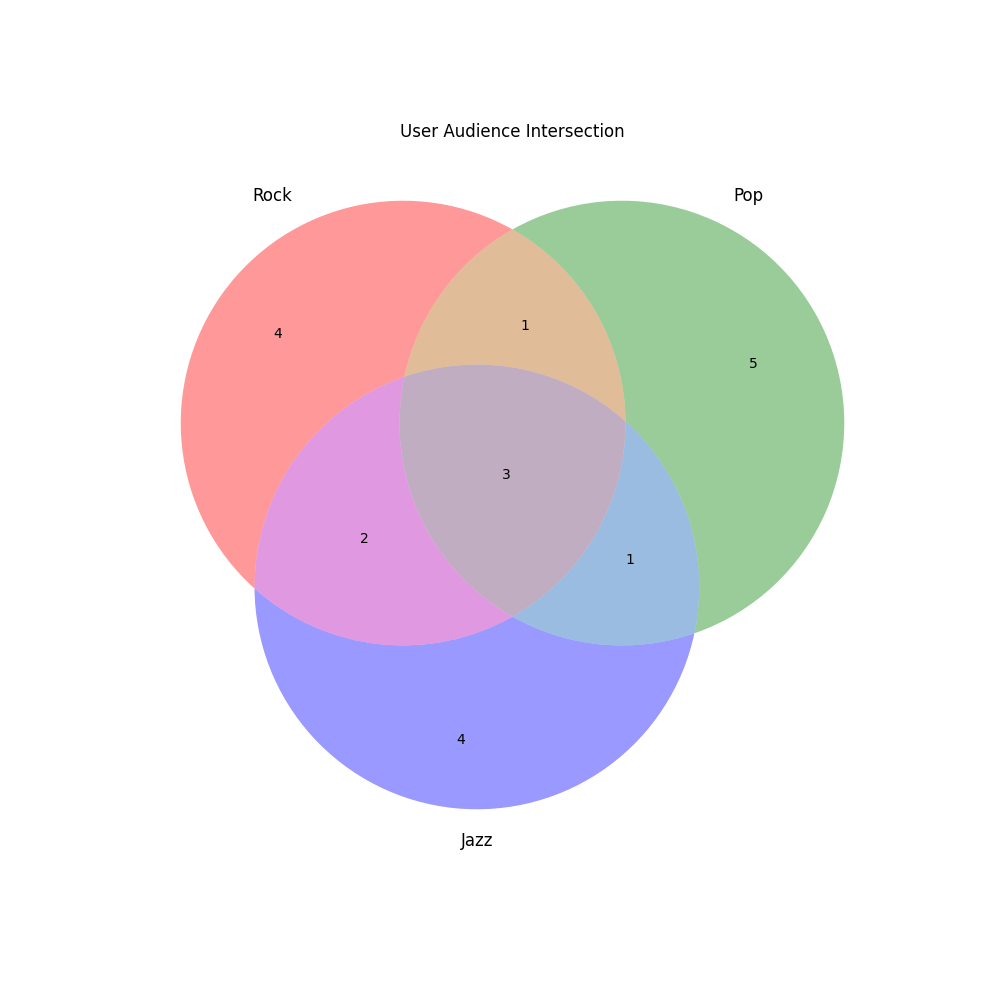

# Task 1: Music Service Analytics Report

## Overview
We analyzed user preference data for a music streaming service to assist the marketing department in planning ad campaigns. The analysis focuses on the intersection of audiences between three genres: Rock, Pop, and Jazz.

## Data Sets
- **Rock Fans:** 10 users
- **Pop Fans:** 10 users
- **Jazz Fans:** 10 users

## Analytics Results

### 1. Total Reach
**Definition:** The count of unique users who listened to at least one of the three genres.
**Method:** Set Union ($A \cup B \cup C$).
- **Count:** 20 unique users.

### 2. "Omnivorous" Music Lovers
**Definition:** Users who listened to **all three** genres. These are highly engaged users.
**Method:** Set Intersection ($A \cap B \cap C$).
- **Count:** 3 users.
- **User IDs:** `{105, 110, 115}`.

### 3. Niche Audience: "Pure Rockers"
**Definition:** Users who listened to Rock but **did not** listen to Pop or Jazz. This is a target for specific genre-based marketing.
**Method:** Set Difference ($Rock - Pop - Jazz$).
- **Count:** 4 users.
- **User IDs:** `{101, 107, 109, 118}`.

### 4. Dual-Genre Listeners
**Definition:** Users who listened to exactly two genres (any pair), excluding those who listened to all three or only one.
**Method:** Union of symmetric differences for pairs: $((A \cap B) - C) \cup ((A \cap C) - B) \cup ((B \cap C) - A)$.
- **Count:** 4 users.
- **User IDs:** `{102, 103, 108, 112}`.
    - *Rock & Pop only:* `{102}`
    - *Rock & Jazz only:* `{103, 112}`
    - *Pop & Jazz only:* `{108}`

## Visualization

Below is the Venn diagram illustrating the overlaps between the three user groups.

## Conclusions for Marketing
1.  **High Overlap:** There is a significant overlap between genres. Specifically, User IDs **105, 110, and 115** appear in every category, making them ideal candidates for "Premium" subscription offers or cross-genre discovery features.
2.  **Targeting:** The "Pure Rockers" group (4 users) is large enough to warrant a specific campaign promoting rock legends or new rock releases, as they do not engage with other genres.