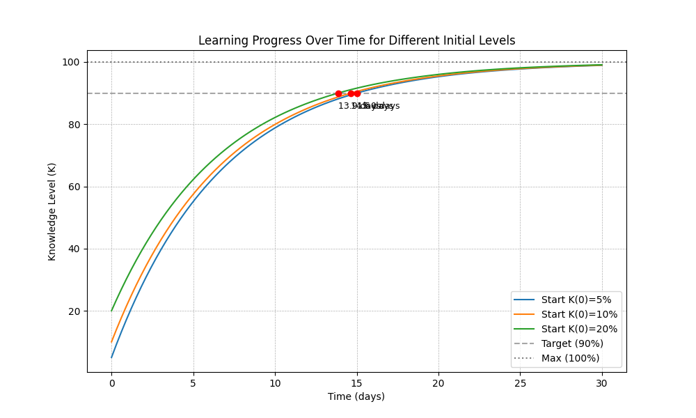

# Task 2: Modeling the Learning Process - Analysis

## 1. Model Overview
We modeled the learning process using the differential equation:
$$\frac{dK}{dt} = 0.15(100 - K)$$

Where:
- $K(t)$ is the current knowledge level.
- $100$ is the mastery level.
- $0.15$ is the learning coefficient.

This equation implies **Diminishing Returns**: as the student's knowledge ($K$) approaches the maximum ($100$), the term $(100 - K)$ becomes smaller, causing the rate of learning ($\frac{dK}{dt}$) to decrease. In other words, it is easy to learn the basics, but it becomes progressively harder to close the final gap to mastery.

## 2. Numerical Results
Using the `solve_ivp` method, we simulated the learning progress for 30 days for three different starting levels ($K_0$). We tracked the time required to reach the **90%** threshold.

| Initial Knowledge ($K_0$) | Time to Reach 90% ($t_{90}$) |
| :--- | :--- |
| **5%** | **15.01 days** |
| **10%** | **14.66 days** |
| **20%** | **13.86 days** |

### Visualization
Below is the graph showing the learning trajectories for all three students over the 30-day period:

## 3. Conclusion
The comparison reveals the impact of initial preparation:

1.  **Time Savings:** The student who started with **20%** knowledge reached the goal approximately **1.15 days earlier** than the student who started with **5%**.
2.  **Non-Linear Impact:** Although the third student started with 4 times as much knowledge as the first student (20% vs 5%), the time saved was not drastically different (only about ~1.1 days). 
    * This is due to the nature of the model: learning is fastest at the beginning. The students with lower starting points learn very quickly in the first few days, allowing them to "catch up" significantly before the learning curve flattens out near the 90% mark.

**Final Verdict:** While a higher initial level does provide a head start, the model suggests that consistent study (the learning rate $r$) is the dominant factor in achieving mastery over time.